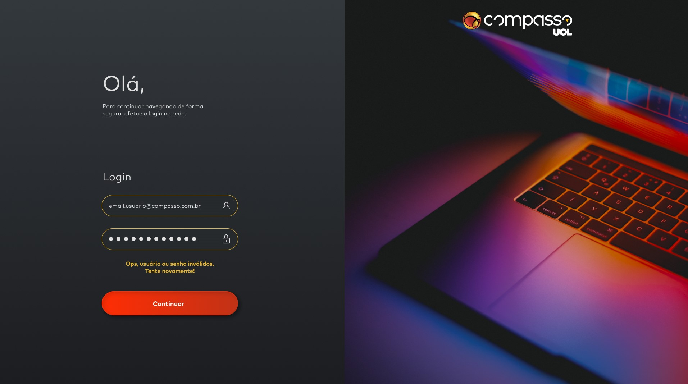

<h1 align="left">🧭 Keepalive</h1>

> Projeto desenvolvido durante a Sprint 4.
> O projeto consiste em uma plataforma para colaboradores da Compass consigam acessar com segurança e usufruir das funcionalidades disponíveis.

## ⭐ índice

- [Sobre o desafio](#Keepalive)

- [Índice](#índice)

- [Funcionalidades](#funcionalidades)

- [À implementar](#funcionalidades-a-implementar)

- [Documentação de cores](#Cores)

- [Screenshots](#Screenshots)

- [Abrir e rodar o projeto](#abrir-e-rodar-o-projeto)

- [Desenvolvedores](#desenvolvedores)

Sobre o desafio
O que o app faz
recursos para implementar
Screenshots
Cores
Skills aplicadas
Ferramentas utilizadas
Autor

## Funcionalidades

- [x] Autenticação de usuário
- [x] Captura e exibição de hora e data
- [x] Temporizador de tempo logado para encerramento ou permanência da sessão
- [x] Armazenamento de informações no LocalStorage (Chave da sessão)
- [x] Botão de encaminhamento para blog da Compass
- [x] Botão de logout da sessão 

## Funcionalidades à implementar

- Captura e exibição da cidade atual de quem acessa
- Captura e exibição da temperatura atual de quem acessa

## Screenshots

--- 

---

## Documentação de cores

| Cores             |Hexadecimal| Cor correspondente                                         |
| ----------------- |-----------| ---------------------------------------------------------- |
| Black             |  #000000  |  |
| White             |  #ffffff  |  |
| Ice               |  #E0E0E0  |  |
| Gray              |  #222222  |  |
| Strong red        |  #C12D18  |  |
| Tomato red        |  #C13216  |  |
| Golden yellow     |  #E9B425  |  |
| Mustard yellow    |  #E29933  |  |
| Bluish gray       |  #26292C  |  |
| Shy black         |  #E9B425  |  |

---

## 👨‍💻 Skills aplicadas/desenvolvidas:

<code></code>
<code></code>
<code></code>
<code></code>

## 💼 Ferramentas Utilizadas:

<code></code>
<code></code>
<code></code>
<code></code>

---

## Autor

<table>
  <tr>
    <td align="center">
      <a href="#">
           
      </a>
    </td>
  </tr>
</table>

 - [@JefersonTavares](https://github.com/JefersonT4v4res)
